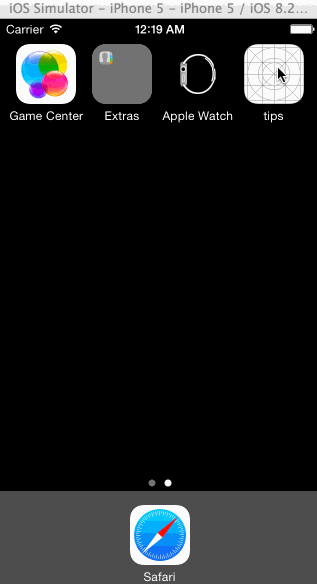

# Tip Calculator

This is an iOS application written in Swift for calculating a tip.

Time spent: 6 hours spent in total

Completed user stories:

 * [x] Required: User can enter a bill amount and tip percentage to calculate the tip and total
 * [x] Required: User can navigate to the Settings page to configure the default tip percentage
 * [x] Optional: Made bill amount text field borderless with prepended dollar sign
 * [x] Optional: Separated tip result area into separate view with different background color
 * [x] Optional: Show/hide tip result area when bill amount is entered using an animation
 * [x] Optional: Show clear button when bill amount is entered
 * [x] Optional: Always show tip percentage segmented buttons for better UX
 * [x] Optional: If bill amount is entered don't clear text field when navigating from Settings to main view
 * [x] Optional: Print current time value to console on view load

Notes:

Spent some time trying to get the app icons and launch images to work but no luck.  Not sure if 
upgrading the project from Xcode 5 to 6 was an issue.

Walkthrough of all user stories:

GIF created with [LiceCap](http://www.cockos.com/licecap/).